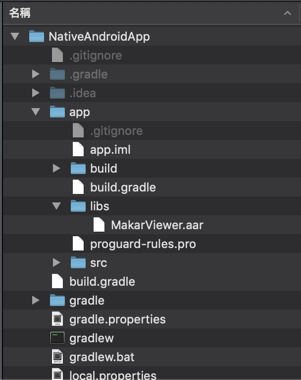
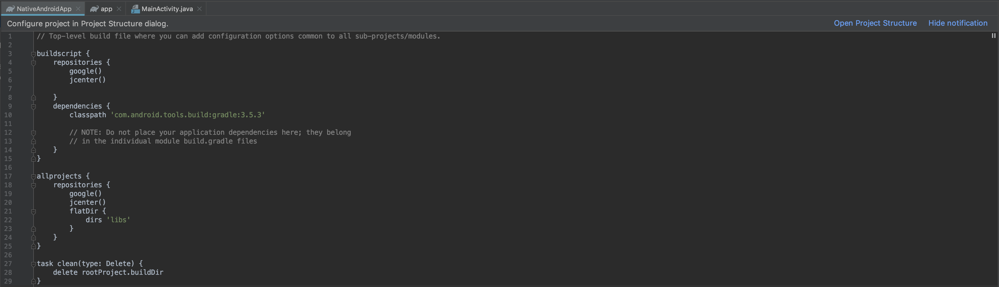
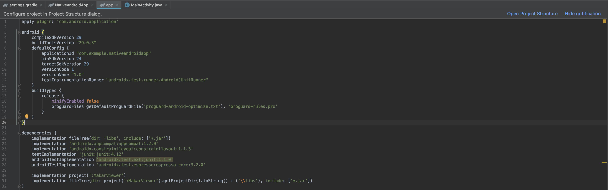
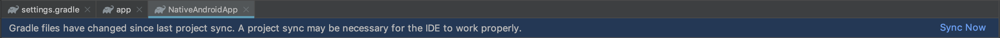
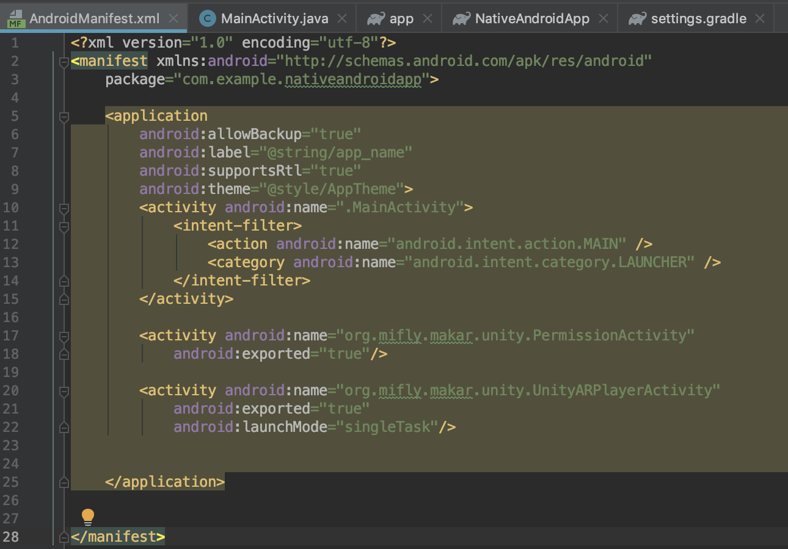

## Integrating Unity as a library into standard Android app

This document explains how to include Unity as a Library into standard Android application through Activity.

Pre-requisites
--------------
- Get API key: Contact <infomakar@miflydesign.com> 

Requirements
--------------
- Android Studio 3.5.3+

Getting Started
--------------
**1. Get source**
- Download Makar Viewer aar [MakarViewer](https://makar-viewer-embed.s3-ap-northeast-1.amazonaws.com/MakarViewer_3_2_0_android_1606703570.zip). 
- Clone or Download GitHub repo [MakarViewerIntegration](https://github.com/vml933/MakarViewerIntegration.git).
- Download and Print AR Marker Image. [Sample Marker Image](https://makar-viewer-embed.s3-ap-northeast-1.amazonaws.com/ARSamplePoster.png).

**2. Add Unity Library module to NativeAndroidApp**
- Put aar file in libs folder
  <br>

- Open build.gradle(Project: NativeAndroidApp) file
  ```
    flatDir {
      dirs 'libs'
    }
  ```
  
- Open build.gradle(Module: app) file
  ```
  implementation(name:'MakarViewer', ext:'aar')
  ```
  

- Click Sync Now to do a project sync since Gradle files have been modified
  

Set AndroidManifest
--------------
- Add PermissionActivity、UnityARPlayerActivity Activity


Script
--------------

- Get MakarViewerManager
```
MakarViewerManager makarViewerManager = MakarViewerManager.getInstance();
```

- Set Makar api key
  - InitializedWithKey(String)
```
makarViewerManager.InitializedWithKey(MAKAR_API_KEY);
```

- load project
  - ShowProjectWithProjectId(String, Enum, Context)
```
makarViewerManager.ShowProjectWithProjectId(PROJECT_ID, AR, getApplicationContext());
```

- Show user page
  - ShowUserWith(String, Context)
```
makarViewerManager.ShowUserWith(USER_ID, getApplicationContext());
```

## Everything is ready

Everything is ready to build, run and debug:
<br>

If all went successfully at this point you should be able to run NativeAndroidApp.

References
-------
- [Integrating Unity as a library into standard Android app](https://github.com/Unity-Technologies/uaal-example)

License
-------
Copyright © MIND & IDEA FLY CO., LTD

Contact
-------
<infomakar@miflydesign.com>
