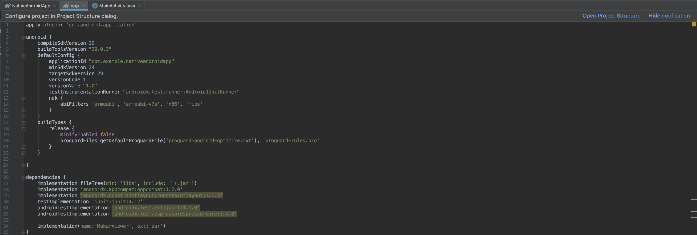
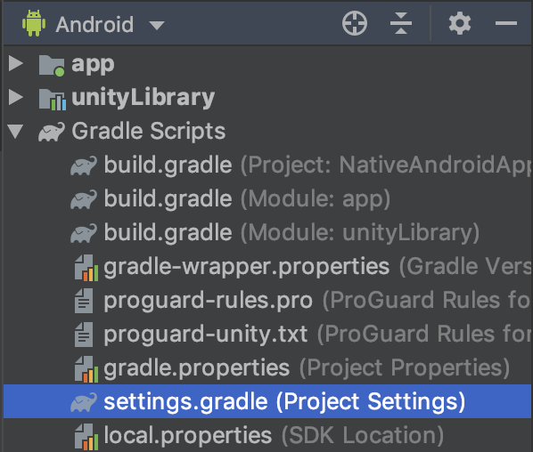

## Integrating Unity as a library into standard Android app

This document explains how to include Unity as a Library into standard Android application through Activity.

Pre-requisites
--------------
- Get API key: Contact <infomakar@miflydesign.com> 

Requirements
--------------
- Android Studio 3.5.3+
- Android NDK r19 or newer required.

Getting Started
--------------
**1. Get source**
- Download Makar Viewer Project [MakarViewer](https://makar.app/makarview_embed.zip). 
- Clone or Download GitHub repo [MakarViewerIntegration](https://github.com/vml933/MakarViewerIntegration.git).
- Create new foler named "Example", extract MakarViewer.zip in it and move NativeAndroidApp Folder at same level.
  <br>
  - NativeAndroidApp - this is simple Android application where we want to integrate our makar viewer project. It has some UI and is prepared to load viewer.
    - MakarViewer - this is a makar viewer project made with Unity which will be integrated to the standard Android application.

**2. Add Unity Library module to NativeAndroidApp**
<br>Do the following to add the exported MakarViewer module to the NativeAndroidApp Gradle project in Android Studio:
- Open NativeAndroidApp in Android Studio
- Open settings.gradle file
  - Add a new project pointing to MakarViewer module at the end of the file: 
  ```
  include ':unityLibrary'
  project(':unityLibrary').projectDir=new File('..\\MakarViewer\\unityLibrary')
  ```
  
- Open build.gradle(Module: app) file
  - Add the following in dependencies{ block
  ```
  implementation project(':MakarViewer')
  implementation fileTree(dir: project(':MakarViewer').getProjectDir().toString() + ('\\libs'), include: ['*.jar'])
  ```
  
- Open build.gradle(Project: NativeAndroidApp) file
  - Add the following in allprojects{repositories{ block
  ```
  flatDir {
    dirs "${project(':MakarViewer').projectDir}/libs"
  }
  ```
  
- Click Sync Now to do a project sync since Gradle files have been modified
  
- If everything succeeds, you should see MakarViewer module added in Android view
  

Set AndroidManifest
--------------
- Add PermissionActivity、UnityARPlayerActivity Activity


Script
--------------

- Get MakarViewerManager
```
MakarViewerManager makarViewerManager = MakarViewerManager.getInstance();
```

- Set Makar api key
  - InitializedWithKey(String)
```
makarViewerManager.InitializedWithKey(MAKAR_API_KEY);
```

- load project
  - ShowProjectWithProjectId(String, Enum, Context)
```
makarViewerManager.ShowProjectWithProjectId(PROJECT_ID, AR, getApplicationContext());
```

- Show user page
  - ShowUserWith(String, Context)
```
makarViewerManager.ShowUserWith(USER_ID, getApplicationContext());
```

## Everything is ready

Everything is ready to build, run and debug:
<br>

If all went successfully at this point you should be able to run NativeAndroidApp.

References
-------
- [Integrating Unity as a library into standard Android app](https://github.com/Unity-Technologies/uaal-example)

License
-------
Copyright © MIND & IDEA FLY CO., LTD

Contact
-------
<infomakar@miflydesign.com>
