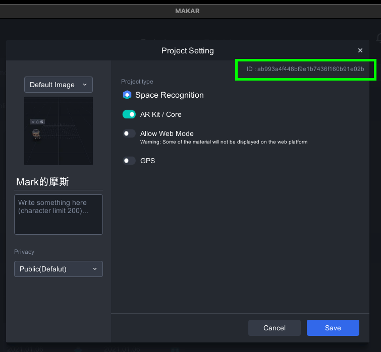

## Integrating Makar Viewer as a library into standard iOS app

This document explains how to include Makar Viewer as a Library into standard iOS application.

Pre-requisites
--------------
- (Option) Get Pro API key: If you want to remove watermark, Contact <infomakar@miflydesign.com>

Requirements
--------------
- Xcode 11.0+

Getting Started
--------------
**1. Get source**
- Download Makar Viewer Framework and files. [Download](https://makar-viewer-embed.s3.ap-northeast-1.amazonaws.com/MakarViewer_3_4_5_ios_1676510340.zip) 
- Clone or Download GitHub repo. [MakarViewerIntegration](https://github.com/miflydesign/MakarViewerIntegration.git)
- Download and Print AR Marker Image. [Sample Marker Image](https://makar-viewer-embed.s3-ap-northeast-1.amazonaws.com/ARSamplePoster.png)

**2. Add UnityFramework.framework**
With this step we add Makar Viewer in the form of a framework to NativeObjc.
- Put UnityFramework.framework and files we just download in your project.
- select NativeObjc target from NativeObjc project
- in "General" tab / "Frameworks, Libraries, and Embedded Content"
- Set "UnityFramework.framework" Embed value is "Embed & Sign"
  <br>
- in "Build Settings" tab, set "Enable Bitcode" to "No"
- in "Build Phases" tab, expand "Link Binary With Libraries"
- remove UnityFramework.framework from the list (select it and press - )
  <br>

**4. Setup Privacy**
- Add the following service setup to `info.plist` file
```
Privacy - Camera Usage Description
Privacy - Photo Library Additions Usage Description
Privacy - Photo Library Usage Description
Privacy - Location Always and When In Use Usage Description
Privacy - Location When In Use Usage Description
Privacy - Location Always Usage Description
```

Script
--------------
- Set valid `makarApiKey` value in AppDelegate.mm
- Initialize MakarViewer in `application didFinishLaunchingWithOptions`
```
[[MakarViewerManager shared] initializedWithKey:makarApiKey
                                         window:self.window
                                  appLaunchOpts:launchOptions
                                          gArgc:gArgc
                                          gArgv:gArgv];   
```
- Implement `MakarViewerDelegate` to receive MakarViewer status
```
-(void)makarDidLoad;
-(void)makarDidUnload;
-(void)makarDidQuit;
-(void)makarRequestOrientation:(NSString*) orientation;
```
- Active MakarViewer and load project
```
[[MakarViewerManager shared] showProjectWithProjectId:PROJECT_ID type: AR];
```
- Unload MakarViewe will release most of the memory it occupies, but not all of it. You will be able to run MakarViewer again.
```
[[MakarViewerManager shared] unload];
```

- Quit MakarViewer completely will release all memory.<br>
Note: You won’t be able to run MakarViewer again in the same process after this call. You can set quitHandler on AppController to override the default process kill.
```
[[MakarViewerManager shared] quit];
```
Learn more in `AppDelegate.mm` and `ViewController.m`

(Option) Get Your Project ID
-------
- You can play your project on device.
- In the [Makar-Editor](https://www.makerar.com/en/download), Click "Settings" from project options.
  <br>
- Project ID is at the Top-Right corner, select and copy the ID, paste it in your code.
  <br>

References
-------
- [Unity Documentation](https://docs.unity3d.com/Manual/UnityasaLibrary-iOS.html)
- [Integrating Unity as a library into standard iOS app](https://github.com/Unity-Technologies/uaal-example)

License
-------
Copyright © MIND & IDEA FLY CO., LTD

Contact
-------
<infomakar@miflydesign.com>
