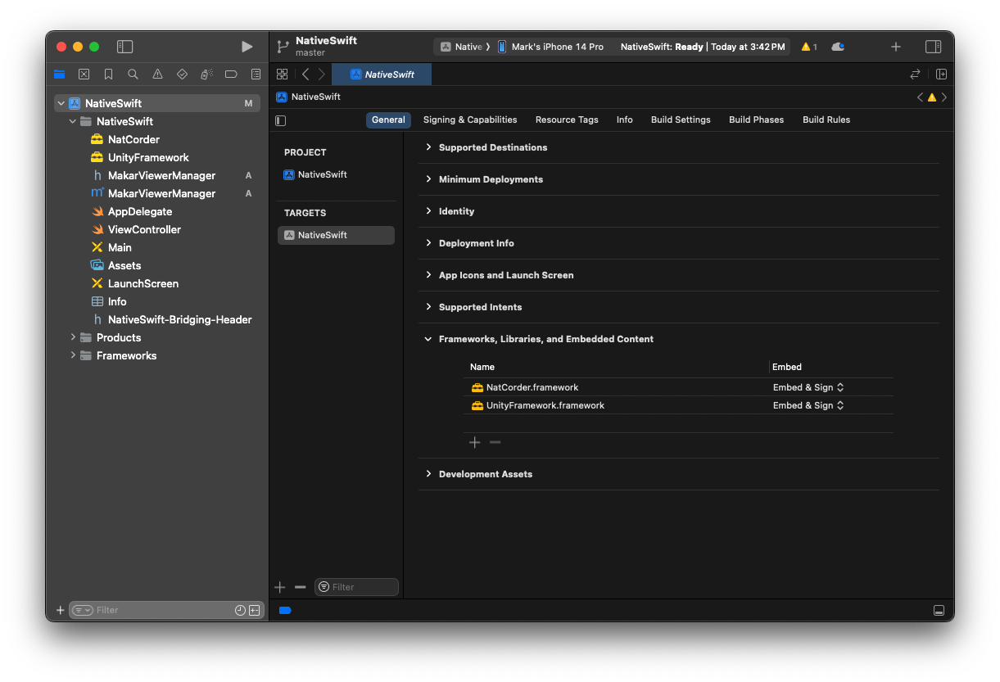
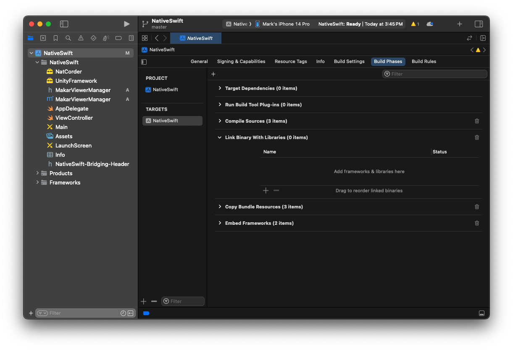
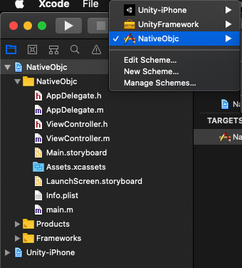

## Integrating Makar Viewer as a library into standard iOS app

This document explains how to include Makar Viewer as a Library into standard iOS application. You can read more about [Unity as a Library](https://docs.unity3d.com/2019.3/Documentation/Manual/UnityasaLibrary.html).

Pre-requisites
--------------
- Sign up and get API key from [Makar development](https://developer.makar.app). 

Requirements
--------------
- Xcode 11.0+

Getting Started
--------------
**1. Get source**
- Download Makar Viewer Project [MakarViewer](https://github.com/Unity-Technologies/uaal-example). 
- Clone or Download GitHub repo [MakarViewerIntegration](https://github.com/vml933/MakarViewerIntegration.git).
- Create new foler named "Example", extract MakarViewer.zip in it and move NativeObjc Folder at same level.
	<br>
	- NativeObjc - this is simple Xcode single view application where we want to integrate our makar viewer project. It has some UI and is prepared to load viewer.
    - MakarViewer - this is a makar viewer project made with Unity which will be integrated to the standard iOS application.

**2. Setup Xcode workspace**
Xcode workspace allows to work on multiple projects simultaneously and combine their products
- open NativeObjc.xcodeproj from Xcode
- create workspace and save it at Example/both.xcworkspace. (File / New / Workspace)
  <br>
- close NativeObjc.xcodeproj project all Next steps are done from just created Workspace project
- add NativeObjc.xcodeproj and Unity-iPhone.xcodeproj in MakarViewer folder to workspace on a same level ( File / Add Files to “both” )
  <br>

**3. Add UnityFramework.framework**
With this step we add Makar Viewer in the form of a framework to NativeObjc.
- select NativeObjc target from NativeObjc project
- in "General" tab / "Frameworks, Libraries, and Embedded  Content" press +
- Add Unity-iPhone/UnityFramework.framework
  <br>
- in "Build Phases" tab, expand "Link Binary With Libraries"
- remove UnityFramework.framework from the list (select it and press - )
  <br>

**4. Setup Privacy**
- Add the following service setup to `info.plist` file
```
Privacy - Camera Usage Description
Privacy - Photo Library Additions Usage Description
Privacy - Photo Library Usage Description
Privacy - Location Always and When In Use Usage Description
Privacy - Location When In Use Usage Description
Privacy - Location Always Usage Description
```

Script
--------------
- Set valid `makarApiKey` value in AppDelegate.mm
- Add `#import "AppDelegate.h"` into your ViewController.m.
- Add `@property (strong, nonatomic) AppDelegate *delegate;"` into your ViewController.m.
- Initialize MakarViewer and show.
```
[self.delegate initMakar]
```
- Unload MakarViewer and receive a callback to UnityFrameworkListener after the unload completes. MakarViewer will release most of the memory it occupies, but not all of it. You will be able to run MakarViewer again.
```
[self.delegate unloadMakar]
```
- Pause MakarViewer.
```
[self.delegate pauseMakar]
[self.delegate resumeMakar]
```

- Call this method while a non-MakarViewer View is showing to also show a MakarViewer that’s already running.
```
[self.delegate showMakar]
```

- Unload MakarViewer completely and receive a callback to UnityFrameworkListener when MakarViewer quits. MakarViewer will release all memory.<br>
//Note: You won’t be able to run MakarViewer again in the same process after this call. You can set quitHandler on AppController to override the default process kill.
```
[self.delegate quitMakar]
```

## Workspace is ready
Everything is ready to build, run and debug for both projects: Unity-iPhone and NativeObjc (select NativeObjc scheme to run Native App with integrated Unity or Unity-iPhone to run just Unity App part)
<br>
If all went successfully at this point you should be able to run NativeObjc.

References
-------
- [Unity Documentation](https://docs.unity3d.com/Manual/UnityasaLibrary-iOS.html)
- [Integrating Unity as a library into standard iOS app](https://github.com/Unity-Technologies/uaal-example)

License
-------
Copyright © MIND & IDEA FLY CO., LTD

Contact
-------
<infomarkar@miflydesign.com>